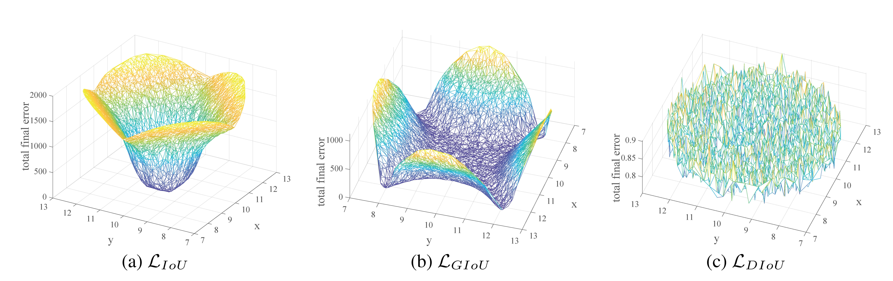
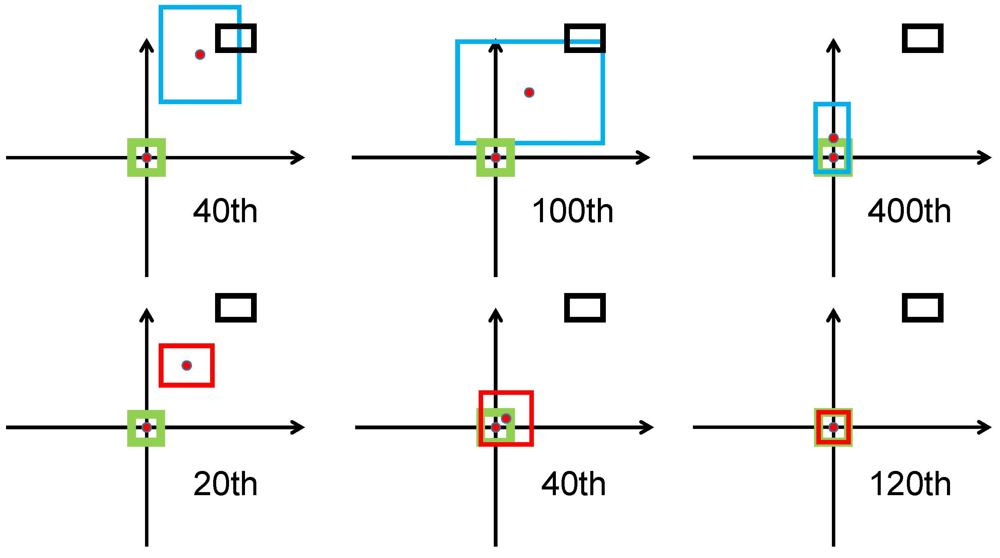
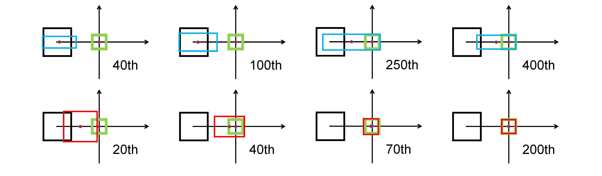
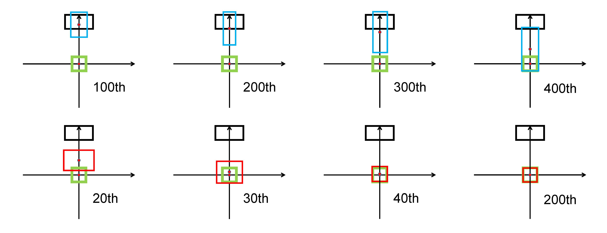

## Complete-IoU Loss and Cluster-NMS for Improving Object Detection and Instance Segmentation. 
#### New released! https://github.com/Zzh-tju/CIoU    
Our paper is accepted by **IEEE Transactions on Cybernetics (TCYB)**.

This is the code for our papers:
 - [Distance-IoU Loss: Faster and Better Learning for Bounding Box Regression][[arxiv](https://arxiv.org/abs/1911.08287)] [[pdf](https://www.researchgate.net/publication/337386850_Distance-IoU_Loss_Faster_and_Better_Learning_for_Bounding_Box_Regression)]
 - [Enhancing Geometric Factors into Model Learning and Inference for Object Detection and Instance Segmentation](https://arxiv.org/abs/2005.03572)

```
@Inproceedings{zheng2020diou,
  author    = {Zheng, Zhaohui and Wang, Ping and Liu, Wei and Li, Jinze and Ye, Rongguang and Ren, Dongwei},
  title     = {Distance-IoU Loss: Faster and Better Learning for Bounding Box Regression},
  booktitle = {The AAAI Conference on Artificial Intelligence (AAAI)},
  pages     = {12993--13000},
  year      = {2020}
}

@Article{zheng2021ciou,
  author    = {Zheng, Zhaohui and Wang, Ping and Ren, Dongwei and Liu, Wei and Ye, Rongguang and Hu, Qinghua and Zuo, Wangmeng},
  title     = {Enhancing Geometric Factors in Model Learning and Inference for Object Detection and Instance Segmentation},
  journal   = {IEEE Transactions on cybernetics},
  volume    = {52},
  number    = {8},
  pages     = {8574--8586},
  year      = {2021},
  publisher = {IEEE}
}
```

## Distance-IoU Loss: Faster and Better Learning for Bounding Box Regression 

## Introduction
Bounding box regression is the crucial step in object detection. In existing methods, while $\ell_n$-norm loss is widely adopted for bounding box regression, it is not tailored to the evaluation metric, i.e., Intersection over Union (IoU). Recently, IoU loss and generalized IoU (GIoU) loss have been proposed to benefit the IoU metric, but still suffer from the problems of slow convergence and inaccurate regression. In this paper, we propose a Distance-IoU (DIoU) loss by incorporating the normalized distance between the predicted box and the target box, which converges much faster in training than IoU and GIoU losses. Furthermore, this paper summarizes three geometric factors in bounding box regression, i.e., overlap area, central point distance and aspect ratio, based on which a Complete IoU (CIoU) loss is proposed, thereby leading to faster convergence and better performance. By incorporating DIoU and CIoU losses into state-of-the-art object detection algorithms, e.g., YOLO v3, SSD and Faster RCNN, we achieve notable performance gains in terms of not only IoU metric but also GIoU metric. Moreover, DIoU can be easily adopted into non-maximum suppression (NMS) to act as the criterion, further boosting performance improvement.


## Getting Started

### 1) DIoU and CIoU losses into Detection Algorithms
DIoU and CIoU losses are incorporated into state-of-the-art detection algorithms, including YOLO v3, SSD and Faster R-CNN. 
The details of implementation and comparison can be respectively found in the following links. 

1. YOLO v3 [https://github.com/Zzh-tju/DIoU-darknet](https://github.com/Zzh-tju/DIoU-darknet)

2. SSD [https://github.com/Zzh-tju/DIoU-SSD-pytorch](https://github.com/Zzh-tju/DIoU-SSD-pytorch)

3. Faster R-CNN [https://github.com/Zzh-tju/DIoU-pytorch-detectron](https://github.com/Zzh-tju/DIoU-pytorch-detectron)


### 2) Simulation Experiments
We provide simulation experiments to analyze the performance given a loss function in controlled settings. 

Download simulation experiment files, you can run it on Matlab. Our matlab version is MATLAB 2017a.

There are two modes that we provide. One is `test_1715k.m` and the other is `simple_test.m`.

`test_1715k.m` provides a large regression samples, for the details of its settings, please refer to our paper.

`simple_test.m` provides a simple toy simulation. You can modify the options `gt` and `pred` to whatever you want. 

This is a convenient and intutive way to see how IoU based loss works. All the gradients of these four IoU based losses are calculated consistent with our DIoU-Darknet (YOLO v3). Note that the IoU term is necessary, otherwise the comparison will be meaningless. If you find some other forms of loss functions, you can run this simulation to see its convergence, about how fast it is or how much error it has. And these performance will appear in high probability in benchmark training which is our original idea about the simulation.


 

We note that the basins in (a) and (b) correspond to good regression cases. One can see that IoU loss has large errors for non-overlapping cases, GIoU loss has large errors for horizontal and vertical cases, and our DIoU loss leads to very small regression errors everywhere.


## Simulation Examples
We further provide three typical cases in simulation experiments. 

First, the anchor box is set at diagonal orientation.
GIoU loss generally increases the size of predicted box to overlap with target box, while DIoU loss directly minimizes normalized distance of central points. 



Second, the anchor box is set at horizontal orientation. GIoU loss broadens the right edge of prediction box, while the
central point of prediction box only moves slightly towards target box. And then when there is overlap between prediction and
target boxes, the IoU term in GIoU loss would make better match. From the final result at T = 400, one can see that target box
has been included into prediction box, where GIoU loss has totally degraded to IoU loss. 

 

Third, the anchor box is set at
vertical orientation. Similarly, GIoU loss broadens the bottom edge of prediction box, and these two boxes do not match in the
final iteration. In comparison, our DIoU loss converges to good matches in only a few dozen iterations.

 

## Simulation Result Files

We provide txt files for the simulation results. For how to use, please take a look at the end of `simulation experiment/test_1715k.m`

Link: https://pan.baidu.com/s/1ZkVapEsMcqJz3-PfTF2kSA
PW: t3y0
